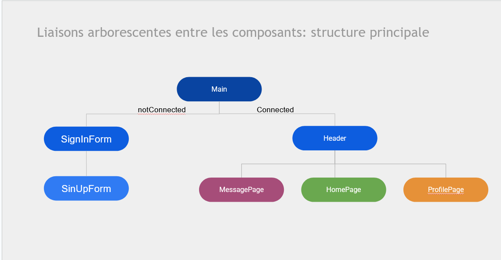
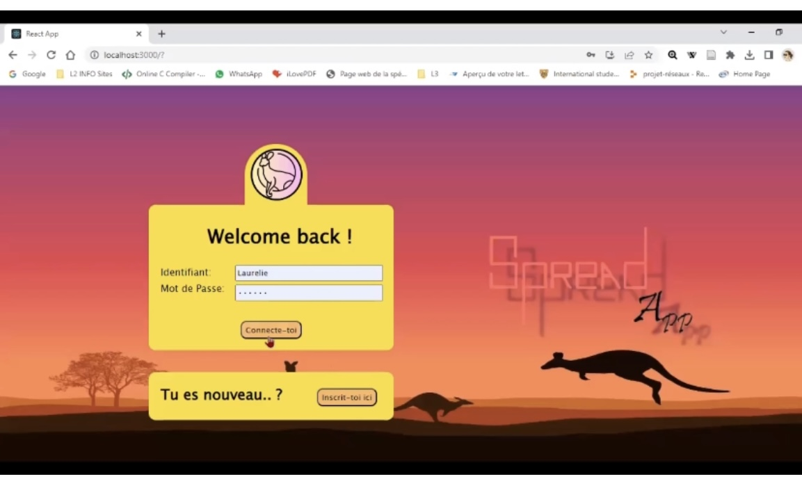

# Projet en Javascript

Création de Spread – Plateforme de Microblogging. 
Cette plateforme permet aux utilisateurs de publier, liker, commenter des posts, et d’échanger entre eux. Le développement s’est appuyé sur React.js pour le frontend, Express.js et Node.js pour le backend, avec MongoDB comme base de données pour la gestion des informations. 

## Front-end
Liaisons arborescentes entre les composants

- SignInForm

## back-end

